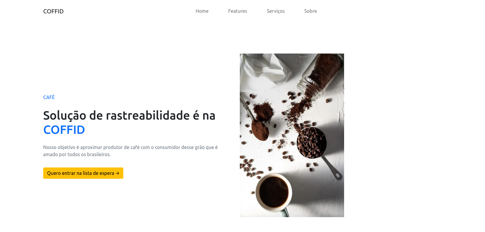

<h1>coffid</h1> 

<p align="center">
  
</p>


> Status do Projeto: :heavy_check_mark: :warning: concluido


This is a [Next.js](https://nextjs.org/) project bootstrapped with [`create-next-app`](https://github.com/vercel/next.js/tree/canary/packages/create-next-app).

### Tópicos 

:small_blue_diamond: [Descrição do projeto](#descrição-do-projeto)

:small_blue_diamond: [Funcionalidades](#funcionalidades)

:small_blue_diamond: [Pré-requisitos](#pré-requisitos)

:small_blue_diamond: [Deploy](#Deploy)


## Descrição do projeto 

<p align="justify">
  Landing page feita com next e react. Para uma startup do ramo do café.
</p>

## Funcionalidades

:heavy_check_mark: Mostrar o conteudo da startup para visitantes

:heavy_check_mark: Atrair leeds

:heavy_check_mark: Gerar engajamento


## Pré-requisitos

:warning: [Node](https://nodejs.org/en/download/)

...

Liste todas as dependencias e libs que o usuário deve ter instalado na máquina antes de rodar a aplicação 

## Como rodar a aplicação :arrow_forward:

No terminal, clone o projeto: 

```bash
npm run dev
# or
yarn dev
```

Open [http://localhost:3000](http://localhost:3000) 


## Linguagens, dependencias e libs utilizadas :books:

- [Next.js Documentation](https://nextjs.org/docs) - learn about Next.js features and API.
- [Learn Next.js](https://nextjs.org/learn) - an interactive Next.js tutorial.


## Resolvendo Problemas :exclamation:

Em [issues]() foram abertos alguns problemas gerados durante o desenvolvimento desse projeto e como foram resolvidos. 

## Tarefas em aberto

:heavy_check_mark: Todas as tarefas concluidas

## Desenvolvedores/Contribuintes :octocat:

Liste o time responsável pelo desenvolvimento do projeto

| [<br><sub>Caio Gomes Braga</sub>](https://github.com/caiobraga) |

## Deploy

The easiest way to deploy your Next.js app is to use the [Vercel Platform](https://vercel.com/new?utm_medium=default-template&filter=next.js&utm_source=create-next-app&utm_campaign=create-next-app-readme) from the creators of Next.js.

Check out our [Next.js deployment documentation](https://nextjs.org/docs/deployment) for more details.
## Licença 

The [MIT License]() (MIT)

Copyright :copyright: 2020 - backendsistematriagem

